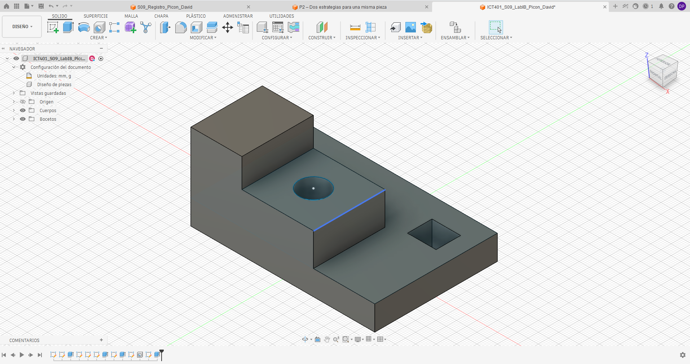
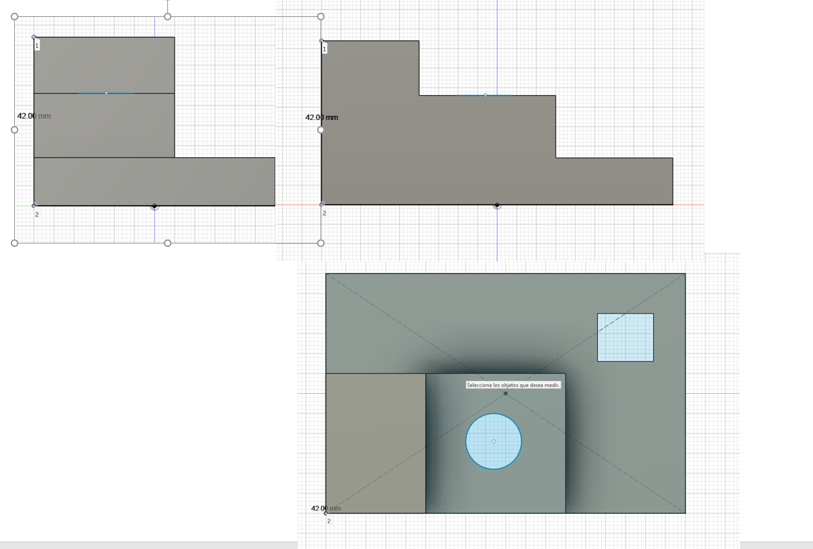
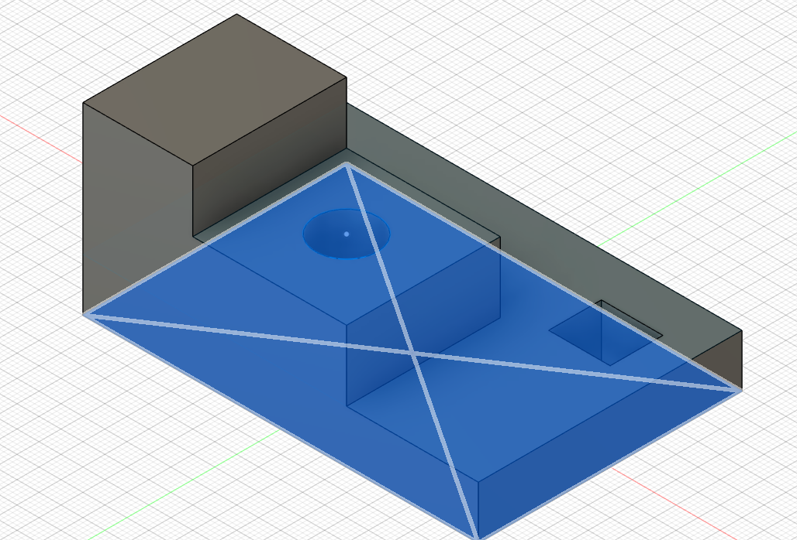
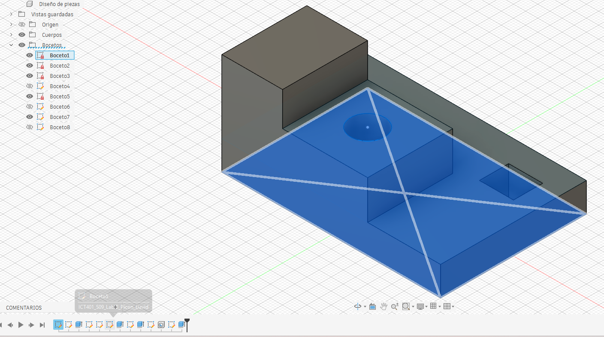
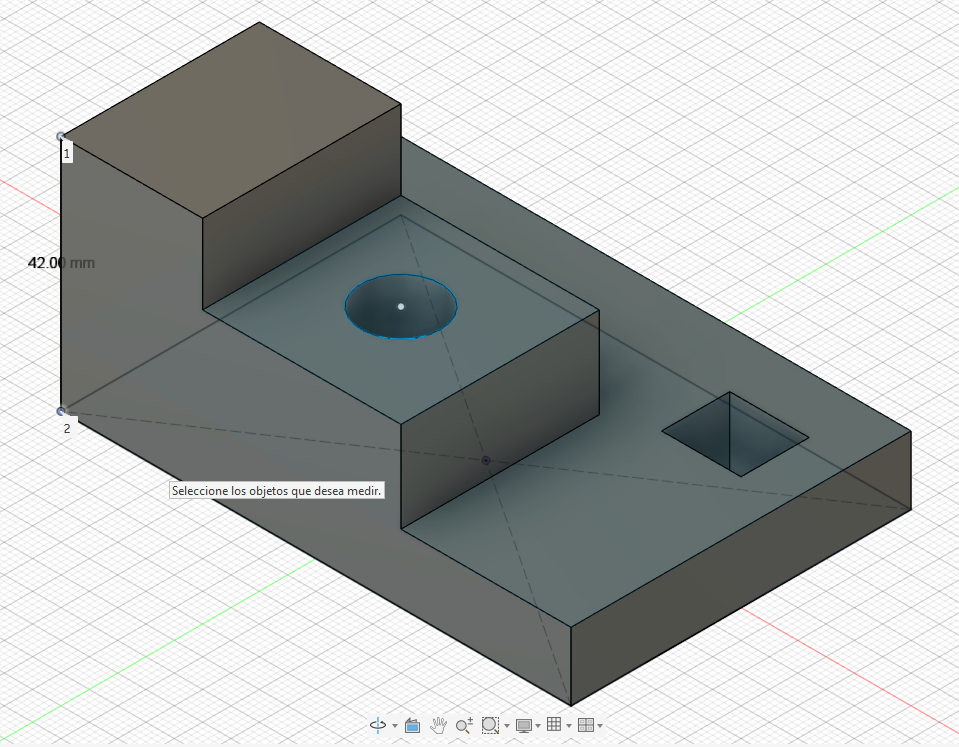

# ICT401 · Semana 9 — Laboratorio integrador I-B

**Reconstrucción 3D a partir de un plano o conjunto de vistas — 10 %**

- Estudiante: [David Picon Mendez]
- Grupo: [60]
- Fecha: [17/9/26]
- Nombre del archivo de Fusion: `ICT401_S09_LabIB_Apellido_Nombre`
- Carpeta/proyecto de Fusion Cloud con acceso docente: [David Picon]
- Commit de entrega: [Respuesta]

## Instrucciones de uso de esta ficha

Complete esta ficha durante el laboratorio. No borre respuestas iniciales aunque luego las corrija. Cuando cambie una decisión, explique qué evidencia del plano o del modelo motivó la modificación.

La ficha debe quedar en `Portafolio/semana09/` con el nombre `S09_Lab_IB_Evidencias_Apellido_Nombre.md`. Las imágenes enlazadas deben estar en la misma carpeta. El archivo nativo permanece en Fusion Cloud con acceso docente.

Esta ficha forma parte de la evidencia evaluable del Laboratorio integrador I-B y está estructurada para facilitar una revisión posterior por la persona docente o mediante ChatGPT. La calificación final corresponde siempre al instrumento oficial del curso.

---

## A. Interpretación inicial del plano

### A1 · Dimensiones generales

- X total: [90mm]
- Y total: [60mm]
- Z total: [12mm]

### A2 · Características geométricas identificadas

| Nº | Característica | Descripción | Vista(s) que la definen | Dimensiones asociadas |
|---|---|---|---|---|
| 1 | [base] | [Cuerpo rectangular que forma la parte inferior de la pieza] | [Front, Right y Top] | [90 × 60 × 12 mm] |
| 2 | [plataforma] | [Nivel elevado ubicado en la parte posterior de la base] | [Front, Right y Top] | [X = 0–60, Y = 25–60, altura 28 mm] |
| 3 | [torre] | [Parte más alta ubicada sobre la plataforma] | [Front, Right y Top] | X = 0–25, Y = 25–60, altura 42 mm]
| 4 | [agujero] | [Perforación circular pasante ubicada en la plataforma] | [Top, Front y Right] | [Ø14 mm, centro (42,42)] |
| 5 | [ranura] | [Abertura rectangular ubicada en la zona derecha de la base] | [Top, Front y Right] | [14 × 12 mm, X = 68–82, Y = 10–22] |

### A3 · Describa la pieza en una frase técnica antes de abrir Fusion

[La pieza es un sólido escalonado formado por una base rectangular, una plataforma elevada, una torre superior, un agujero circular pasante de Ø14 mm y una ranura rectangular de 14 × 12 mm.]

### A4 · ¿Qué plano de boceto utilizará primero y por qué?

[Utilizaré primero el plano XY porque permite construir la base de 90 × 60 mm directamente a partir de la vista Top y establecer las posiciones de las demás características en X e Y.]

### A5 · Estrategia inicial de modelado

1. Crear un Sketch en el plano XY y dibujar la base de 90 × 60 mm
2.Acotar el Sketch con 90 mm de ancho y 60 mm de profundidad y extruirlo 12 mm para formar la base.
3. Crear un segundo Sketch sobre la cara superior de la base para definir la plataforma, con X = 0–60 y Y = 25–60.
4.Extruir la plataforma 16 mm para alcanzar una altura total de 28 mm.
5. Crear la torre sobre la plataforma con X = 0–25 y Y = 25–60, y extruirla 14 mm hasta alcanzar los 42 mm de altura total.
6.Crear y cortar el agujero Ø14 con centro (42,42) y la ranura de 14 × 12 mm ubicada en X = 68–82 y Y = 10–22.

---

## B. Desarrollo del modelo

### B1 · Boceto base

- Plano seleccionado: [XY]
- Geometría principal:Rectángulo de la base
- Restricciones aplicadas:Coincidente con el origen, horizontal y vertical.
- Dimensiones aplicadas: 90 mm de ancho × 60 mm de profundidad.
- Estado del boceto: Totalmente restringido.

### B2 · Operaciones principales realizadas

| Orden | Operación | Propósito geométrico | Parámetro/dimensión principal | Resultado |
|---|---|---|---|---|
| 1 | [Sketch base | Crear la forma rectangular inicial] | 90x60 mm | [Perfil de la base] |
| 2 | [Extrude base | Crear el volumen de la base | 12mm | [Perfil de la base] |
| 3 | [Sketch plataforma | Definir la plataforma superior] | X = 0–60, Y = 25–60 | [Perfil de plataforma] |
| 4 | Extrude plataforma | Elevar la plataforma | [16 mm] | [Altura total de 28 mm] |
| 5 | [Sketch torre | Definir la parte superior| X = 0–25, Y = 25–60 | [Perfil de torre |
| 6 |Extrude torre] | Elevar la torre] | 14 mm | Altura total de 42 mm|

### B3 · Cambios respecto a la estrategia inicial

| Cambio realizado | Motivo | Vista/dimensión que reveló el problema | Sketch/operación corregida |
|---|---|---|---|
| Ajuste de la posición de la plataforma] | [Hacer coincidir la plataforma con el plano | Vista Top: X = 0–60 y Y = 25–60] | Sketch plataforma |
| juste de la altura de la torre] | Conseguir la altura total indicada | Vista Front: altura de 42 mm| Extrude torre |
| Ajuste de la posición del agujero | Colocar correctamente el centro de la perforación] | Vista Top: centro (42,42)] |Extrude torre|

---

## C. Verificación contra el plano

### C1 · Correspondencia de vistas

| Vista | ¿Coincide? | Evidencia geométrica | Diferencia detectada | Corrección realizada |
|---|---|---|---|---|
| Front | si | Se observan los tres niveles de altura y los escalones de la pieza | Ninguna | No fue necesaria |
| Top | si] |Coinciden la base de 90 × 60, la plataforma, la torre, el agujero y la ranura| [Ninguna] | No fue necesaria |
| Right | si] | Coinciden la profundidad de 60 mm y las alturas de 12, 28 y 42 mm | [Ninguna | No fue necesaria |

### C2 · Comprobación dimensional

| Nº | Dimensión crítica | Valor del plano | Valor medido en Fusion | Elemento seleccionado | ¿Coincide? |
|---|---|---|---|---|---|
| 1 | [Respuesta] | [Respuesta] | [Respuesta] | [Respuesta] | [Respuesta] |
| 2 | [Respuesta] | [Respuesta] | [Respuesta] | [Respuesta] | [Respuesta] |
| 3 | [Respuesta] | [Respuesta] | [Respuesta] | [Respuesta] | [Respuesta] |
| 4 | [Respuesta] | [Respuesta] | [Respuesta] | [Respuesta] | [Respuesta] |
| 5 | [Respuesta] | [Respuesta] | [Respuesta] | [Respuesta] | [Respuesta] |

### C3 · Editabilidad paramétrica

Si una dimensión principal de la pieza cambiara, indique qué Sketch, dimensión u operación tendría que editar y por qué.

Si cambiara una dimensión principal, editaría el Sketch u operación relacionada con esa característica. Por ejemplo, si cambiara el ancho total de 90 mm, modificaría la cota horizontal de 90 mm del Sketch base, ya que esta dimensión controla el tamaño principal de la pieza. Si cambiara la altura de la torre, modificaría la distancia de la operación Extrude de la torre para mantener la altura total indicada en el plano.]

---

## D. Evidencias

### D1 · Modelo final

Modelo completo en orientación pictórica, con nombre del diseño y ViewCube visibles.

### D2 · Vistas de verificación

Montaje de Front, Top y Right del modelo, presentado de manera clara para comparar con el plano base.

### D3 · Boceto y restricciones

Captura del boceto más representativo con restricciones y dimensiones visibles.

### D4 · Timeline / historial paramétrico

Captura donde se observen las operaciones principales del historial del modelo.

### D5 · Verificación dimensional

Captura de `Inspect > Measure` con una dimensión crítica y el elemento seleccionado visibles.

---

## E. Checklist de entrega

- [ ] Analicé el plano antes de comenzar el modelado.
- [ ] Registré X, Y y Z totales.
- [ ] Identifiqué las características principales y las vistas que las definen.
- [ ] Registré una estrategia inicial antes de modelar.
- [ ] El modelo final corresponde a Front, Top y Right.
- [ ] Verifiqué al menos cinco dimensiones críticas.
- [ ] Los bocetos principales tienen restricciones y dimensiones coherentes.
- [ ] El historial de operaciones es legible y editable.
- [ ] El nombre del archivo cumple la nomenclatura solicitada.
- [ ] El archivo editable está disponible en Fusion Cloud con acceso docente.
- [ ] Las cinco evidencias se visualizan correctamente en GitHub.
- [ ] Esta ficha está completa.

---

# F. Rúbrica oficial del Laboratorio integrador I-B

> Esta rúbrica reproduce los criterios y valores establecidos en el programa oficial. La persona docente puede anotar el puntaje obtenido y observaciones en las columnas finales.

| Criterio oficial | Valor máximo | Evidencia principal en esta ficha | Puntaje obtenido | Observaciones de evaluación |
|---|---:|---|---:|---|
| Interpretación correcta del plano o conjunto de vistas | 2,0 % | Secciones A1–A5 y C1 | [Evaluador] | [Evaluador] |
| Reconstrucción tridimensional coherente | 2,5 % | Secciones B1–B3, D1 y D2 | [Evaluador] | [Evaluador] |
| Aplicación de restricciones y dimensiones | 1,5 % | B1, D3 y C2 | [Evaluador] | [Evaluador] |
| Precisión geométrica y correspondencia con el plano | 2,0 % | C1, C2, D2 y D5 | [Evaluador] | [Evaluador] |
| Organización, nomenclatura y archivo editable | 1,0 % | Identificación, B2, D4 y checklist | [Evaluador] | [Evaluador] |
| Presentación y cumplimiento del enunciado | 1,0 % | Ficha completa, evidencias y checklist | [Evaluador] | [Evaluador] |
| **Total** | **10,0 %** |  | **[Evaluador]** | **[Evaluador]** |

## G. Resumen para evaluación asistida por ChatGPT

Este bloque debe permitir una revisión rápida sin tener que inferir información faltante.

- ¿El estudiante interpretó correctamente X, Y y Z? [Respuesta]
- ¿Las características listadas corresponden con el plano? [Respuesta]
- ¿La estrategia inicial es coherente? [Respuesta]
- ¿El modelo final coincide con las tres vistas? [Respuesta]
- ¿Las dimensiones críticas coinciden? [Respuesta]
- ¿Los bocetos muestran restricciones y dimensiones adecuadas? [Respuesta]
- ¿El timeline muestra una reconstrucción paramétrica razonable? [Respuesta]
- ¿El archivo y las evidencias cumplen nomenclatura y presentación? [Respuesta]
- Incidencias que el evaluador debería revisar directamente en Fusion: [Respuesta]

## H. Retroalimentación del evaluador

### Fortalezas

[Evaluador]

### Aspectos por corregir

[Evaluador]

### Calificación final

**[Evaluador] / 10,0 %**
