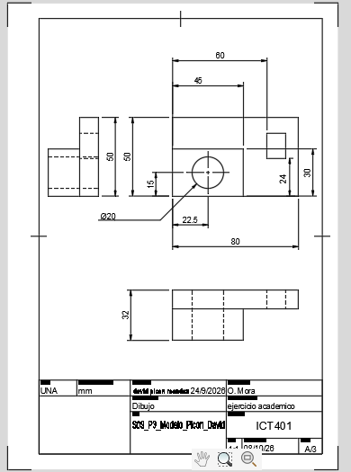
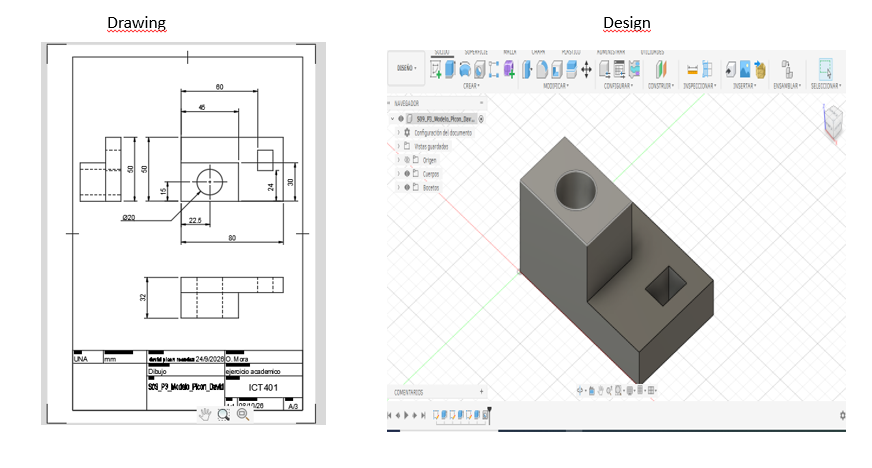
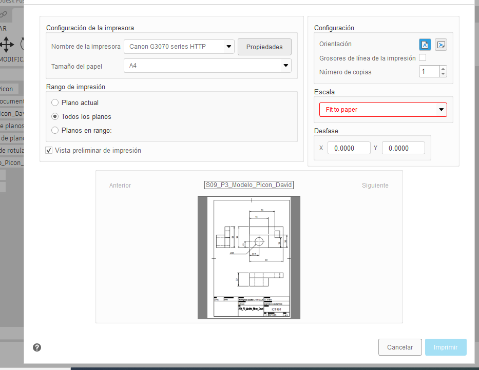
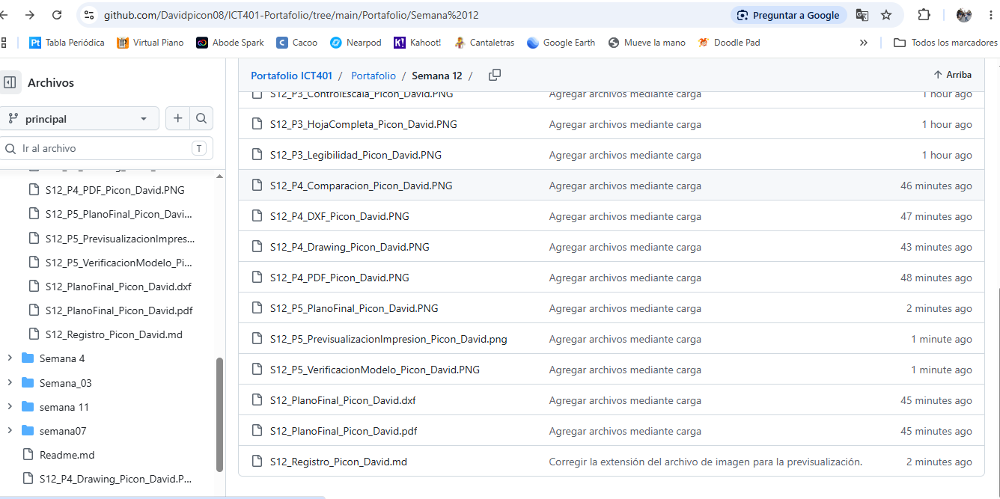

## P5 — Laboratorio integrador II-A, impresión y entrega

**Propósito:** integrar, revisar y entregar el plano técnico completo a partir del Drawing corregido en P1–P4. P5 es evaluativo; no cree un plano nuevo ni repita el proceso desde cero.

**Valor:** Laboratorio integrador II-A, 10 %. La Fase 2 del Proyecto tiene valor de 7 % y se entrega según su enunciado y rúbrica oficiales.

### P5.0 · Pasos en Fusion

1. Abra el Drawing que conserva las correcciones de P1 a P4.
2. Confirme que el modelo y el Drawing pertenecen al mismo proyecto y pieza.
3. Revise en la hoja completa formato, orientación, márgenes y distribución.
4. Revise el cajetín: código ICT401, título, autoría, fecha, unidades, escala y campos de la plantilla.
5. Revise alineación de `Front`, `Top` y `Right`, sección, detalle, cotas y tolerancias.
6. Cambie a `Design` y compare una característica visible del plano con el modelo 3D.
7. Registre cualquier discrepancia; no maquille el Drawing para que coincida visualmente.
8. Regrese a `Drawing` y aplique la corrección indicada por la revisión.
9. Ejecute `Output > PDF`, abra el PDF y compruebe que no hay recortes ni deformaciones.
10. Ejecute `Output > DXF` únicamente si corresponde y revise su contenido.
11. Abra `Output > Print` o la previsualización de impresión.
12. Compruebe papel, orientación, escala, márgenes y ausencia de recorte. Si se exige escala técnica, no seleccione `Fit to page`.
13. Guarde el Drawing en Fusion Cloud y confirme acceso docente.
14. Organice ficha, imágenes, PDF, DXF y enlaces en la carpeta oficial.
15. Complete el checklist final y registre los pendientes reales.

### P5.1 · Checklist

- [✓ ] El modelo y el Drawing corresponden a la misma pieza.
- [✓ ] El formato y la orientación son adecuados.
- [✓ ] El cajetín está completo y legible.
- [✓ ] El formato, marco y zona de identificación fueron revisados con el criterio de ISO 5457.
- [✓ ] Los campos del cajetín fueron contrastados con INTE/ISO 7200:2008 y las limitaciones quedaron registradas.
- [ ✓] La escala del cajetín coincide con la configuración del plano.
- [ ✓] Las vistas están alineadas y no falta información necesaria.
- [✓ ] El corte, la sección y el detalle conservan su identificación.
- [✓ ] Las cotas y tolerancias son legibles y no están superpuestas.
- [✓ ] Las cotas necesarias aparecen una sola vez, salvo indicación auxiliar, y se revisaron con ISO 129-1.
- [✓ ] El PDF abre correctamente y coincide con el Drawing.
- [✓ ] El DXF fue generado y revisado cuando corresponde.
- [✓ ] La previsualización de impresión no presenta recortes ni deformaciones.
- [✓ ] La ficha y las imágenes tienen la nomenclatura solicitada.
- [✓ ] El enlace de Fusion Cloud tiene acceso docente.
- [✓ ] Modelo, Drawing y archivos exportados no presentan contradicciones y la revisión o versión quedó identificada.
- [✓] La Fase 2 del Proyecto fue entregada según su enunciado.

### P5.2 · Revisión por pares

| Criterio | Observación recibida | Corrección aplicada |
|---|---|---|
| Formato y orientación | Se debía verificar que el tamaño y la orientación de la hoja fueran correctos. | Se revisó el formato de la hoja y se confirmó que la orientación correspondiera al plano. |
| Cajetín | Se debía comprobar que el cajetín estuviera completo y legible. | Se verificaron los datos del cajetín y su correcta ubicación en la hoja. |
| Escala y legibilidad | Algunas cotas y anotaciones podían resultar difíciles de leer. | Se revisó la escala de las vistas y se comprobó la legibilidad de las cotas y anotaciones. |
| Distribución de vistas | Se debía verificar que las vistas estuvieran ordenadas y bien distribuidas. | Se revisó la ubicación de las vistas para mantener una distribución clara y evitar superposiciones. |
| PDF/DXF e impresión | Se debía comprobar que la exportación conservara el formato y el contenido del Drawing. | Se exportó el plano a PDF y se revisó que la hoja, las vistas, las cotas y el cajetín aparecieran completos. |
### Evidencias P5

**Qué debe contener cada imagen:**

- `S12_P5_PlanoFinal_Apellido_Nombre.png`: hoja completa en Fusion, con cajetín legible y todos los elementos del plano.
- `S12_P5_VerificacionModelo_Apellido_Nombre.png`: comparación etiquetada entre `Drawing` y `Design`, con una orientación que permita comprobar una característica representada.
- `S12_P5_PrevisualizacionImpresion_Apellido_Nombre.png`: previsualización con papel, orientación, escala y márgenes visibles.
- `S12_P5_Entrega_Apellido_Nombre.png`: carpeta o plataforma oficial de entrega mostrando ficha, PDF, DXF cuando corresponda y archivos organizados.

## Reflexión final

### 1. ¿Por qué el formato seleccionado es adecuado para este plano?

[Porque se adapta mejor el tamaño de las vsitas y aprovechando todo el espacio de la hoja]

### 2. ¿Qué información del cajetín identifica o contextualiza el plano?

[La escala, las uidades, y el tamaño de la hoja]

### 3. ¿Qué problema de escala o legibilidad detecté y cómo lo resolví?

[Que el tamaño de las vistas era muy inferior a la de la hoja y lo solucione aumentando el tamaño de la hoja]

### 4. ¿Qué diferencia encontré entre el Drawing y la salida exportada?

[Que en el dxt no aparecen las cotas]

### 5. ¿Cómo comprobé que la impresión no deformara ni recortara el plano?

[Porque al poner el tamaño de impresion el tamaño coincide con el que se va a imprimir]

### 6. ¿Qué corrección mejoró más la calidad del plano?

[Cambiar la orientacion]

## Cierre de la ficha

- [ ✓] Completé las respuestas de P1 a P5.
- [ ✓] Incorporé todas las evidencias con la nomenclatura solicitada.
- [✓ ] Las imágenes se visualizan correctamente desde el medio oficial de entrega.
- [✓ ] El PDF fue abierto y comparado con el Drawing.
- ✓[ ] El DXF fue revisado cuando correspondía.
- [✓ ] El modelo y el Drawing están disponibles en Fusion Cloud con acceso docente.
- [✓ ] Documenté las correcciones sin borrar decisiones iniciales.
- [✓ ] La Fase 2 del Proyecto fue organizada según su rúbrica.
- [✓ ] Entregué los últimos cambios mediante el medio oficial indicado.

Nombre sugerido para la entrega: `S12_PlanoFinal_Apellido_Nombre`.
