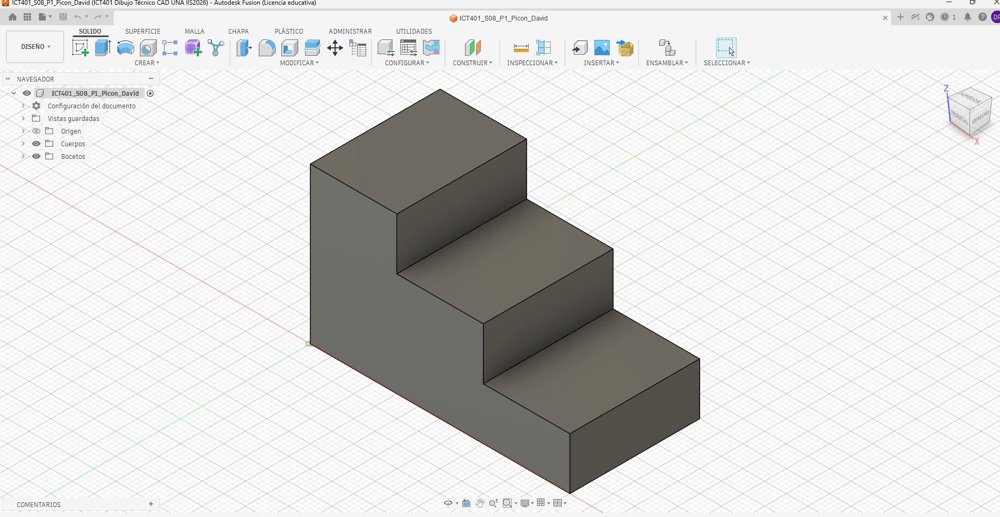
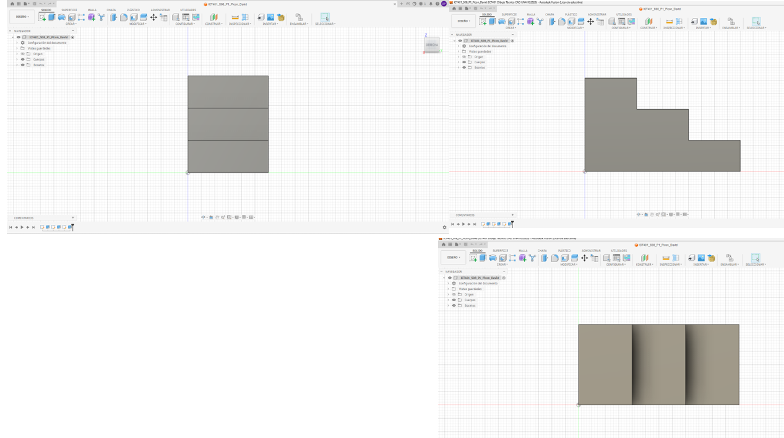
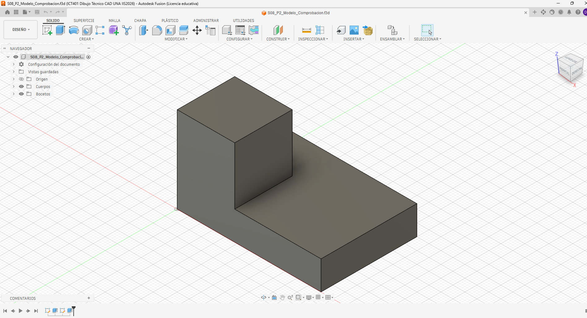

# ICT401 · Semana 8 — Registro formativo de práctica en Fusion

7 al 12 de septiembre de 2026. V Congreso Universitario. Consolidación de contenidos. Sin evaluaciones.

- Estudiante: [David Picon Mendez]
- Grupo: [60]
- Carpeta o proyecto de Fusion Cloud con acceso docente (sin enlaces privados): [Respuesta]
- Modelos proporcionados: `S08_P1_Modelo_Observacion.f3d` y, después de P2, `S08_P2_Modelo_Comprobacion.f3d`.
- Copias personales: `ICT401_S08_P1_Apellido_Nombre` y `ICT401_S08_P2_Apellido_Nombre`.
- Diseños propios: `ICT401_S08_P4_Apellido_Nombre` y `ICT401_S08_P5_Apellido_Nombre`.

## Instrucciones

Copie esta plantilla a `Portafolio/semana08/` y guárdela como `S08_Registro_Apellido_Nombre.md`. Sustituya `Apellido_Nombre` en todos los nombres y enlaces por un apellido y un nombre sin espacios ni tildes. Complete cada [Respuesta], agregue las ocho imágenes en esa misma carpeta y haga commit. No necesita construir otra plantilla.

Escriba las predicciones y decisiones iniciales antes de comprobar. **Nunca borre una respuesta inicial incorrecta:** conserve lo escrito y agregue la corrección y su causa en el apartado posterior. Use la guía para los recursos gráficos y los tiempos de cada P1–P5 (50 minutos cada uno).

X = ancho, Y = profundidad, Z = altura; milímetros. Primer diedro: Right a la izquierda de Front y Top debajo de Front. Cámara ortográfica. Los montajes documentan correspondencia, no son planos a escala: compruebe dimensiones con Measure, no con píxeles. Combine capturas con una herramienta de imágenes o diapositivas y guarde un único PNG por nombre; no deforme imágenes ni oculte el ViewCube. Los recortes temporales no se entregan.

## P1 — Del modelo 3D a las vistas

### P1.1 · Antes de seleccionar Front, Top o Right: ¿qué características, caras y aristas espera ver en cada vista y qué dimensiones aparecerán horizontal y verticalmente?

[En Front espero observar el ancho y la altura de la pieza, ya que esta vista representa los ejes X–Z. Horizontalmente aparece X y verticalmente Z. En Top espero observar el ancho y la profundidad, correspondientes a X–Y. En Right espero observar la profundidad y la altura, correspondientes a Y–Z.]

### P1.2 · ¿Cuál vista considera inicialmente más informativa y por qué?

[Considero que Front es inicialmente la vista más informativa porque permite identificar directamente el ancho y los diferentes niveles de altura de la pieza. Sin embargo, Top y Right son necesarias para determinar la profundidad y relacionar correctamente las características tridimensionales.]

### P1.3 · Después de observar Front, Top y Right: ¿qué predicciones confirmó y qué corrigió? Explique por qué sin borrar su respuesta inicial.

[Yo creo que confirme todas las predicciones]

### P1.4 · ¿Qué pares de vistas comparten ancho, altura y profundidad? Anote el valor comprobado en milímetros y la arista seleccionada.

[Front y top comparte el ancho de 60mm
front y right comparten la altura z de 36 mm
top y right comparten la profundidad y de 64.62 mm]

### P1.5 · Elija una característica tridimensional: ¿cómo aparece en dos vistas diferentes? Identifique las caras o aristas relacionadas.

[un cambio de nivel puede aparecer por otro lado ]

| Vista | Predicción inicial: características y dimensiones | Observación posterior | Correccion y Causa |
|---|---|---|---|
| Front | [X=Ancho y Z=Altura] | [El contorno frontal y cambios de altura] | [Comprueba la forma frontal y mide una arista] |
| Top | [X=Ancho y Y=Profundidad] | [La distribución de la pieza desde arriba] | [Comprueba ancho y profundidad] |
| Right | [Y=Profundidad y Z=Altura] | [Cambios de profundidad y altura] | [Comprueba profundidad y alturas] |

| Dimensión compartida | Par de vistas | Valor (mm) y arista seleccionada |
|---|---|---|
| Ancho | [Front ↔ Top] | [60mm] |
| Altura | [Top ↔ Right] | [36mm] |
| Profundidad | [Front ↔ Right] | [20mm] |

### Evidencias

Modelo completo en orientación pictórica, ViewCube y nombre de su copia visibles.

Un montaje de tres capturas de Fusion: Right a la izquierda, Front a la derecha y Top debajo de Front; etiquetas y cuerpo completo visibles.

## P2 — De las vistas al modelo mental

### P2.1 · ¿Qué forma general imagina y cuáles son sus cambios de altura?

[Imagino una pieza prismática maciza formada por diferentes niveles de altura. Los cambios de altura deben poder relacionarse entre Front y Right.]

### P2.2 · ¿La profundidad se mantiene o cambia entre zonas? Relacione las tres vistas.

[La profundidad debe determinarse principalmente mediante Top y Right. Las zonas que cambian de profundidad deben conservar correspondencia entre ambas vistas.]

### P2.3 · ¿Qué correspondencias encuentra entre vistas?

[Front y Top deben conservar el mismo ancho X. Front y Right deben conservar la misma altura Z. Top y Right deben conservar la misma profundidad Y.a]

### P2.4 · ¿Qué información aporta Top y qué información aporta Right?

[Top permite determinar el ancho X y la profundidad Y, además de localizar características desde el frente hacia el fondo, Right permite determinar la profundidad Y y la altura Z, y ayuda a reconocer los cambios de nivel desde el frente hacia el fondo.]

### P2.5 · Describa verbalmente la pieza imaginada antes de mirar las alternativas.

[Imagino una pieza maciza con forma escalonada]

### P2.6 · ¿Selecciona A, B, C o D? Justifique antes de comprobar y descarte cada una de las otras tres mediante una vista.

[Selecciono A. A coincide con la forma de las tres vistas. B se descarta por la distribución de profundidad del bloque. C se descarta porque presenta una parte elevada adicional en el extremo derecho. D se descarta porque la profundidad del bloque elevado no coincide.
### P2.7 · Después de comprobar: ¿fue correcta su selección, qué interpretó incorrectamente si falló y qué vista fue decisiva? Conserve la selección inicial y explique la corrección.

[Sí, mi selección fue correcta. No tuve que corregir mi interpretación. La vista Front fue decisiva para identificar el cambio de altura.]

| Alternativa | Justificación inicial: seleccionar o descartar | Vista que apoya mi decisión |
|---|---|---|
| A |  [Se descarta porque la zona elevada no coincide correctamente con las vistas] | [Top y Right] |
| B | [La distribucion de la zona elevada y la zona de menor altura coincide con las vistas] | [Top, Front y right] |
| C | [Se descarta porque presenta una zona elevada diferente y una distribucion de alturas incorrectas] | [Top] |
| D | [Se descarta porque la posicion de la zona elevada y su relacion con la profundidad no coinciden] | [Front] |

### Evidencias

Modelo correcto proporcionado por el docente durante la comprobación, en orientación pictórica, con nombre y ViewCube visibles.

## P3 — Detectives de vistas

### P3.1 · Caso A: ¿qué vista parece incorrecta, qué línea produce la inconsistencia, con cuál otra vista entra en contradicción y cómo debería corregirse?

[La vista Front,	La línea que representa el cambio de nivel y que no coincide con las caras mostradas en las otras vistas.	Contradice principalmente la vista Top.
La vista debe modificarse para que las aristas y el cambio de nivel coincidan con la geometría real del modelo.]

### P3.2 · Caso B: ¿qué dimensión debería conservarse, dónde aparece la contradicción, qué información permite comprobarla y cómo debería corregirse?

[La profundidad Y. Top indica 48 mm y Right indica 40 mm.	Porque Top y Right representan la misma dimensión Y, por lo que la profundidad debe ser igual en ambas vistas.	Con Inspect → Measure, midiendo la arista completa correspondiente a la profundidad.
	Se debe corregir la vista que tenga el valor incorrecto para que ambas indiquen la profundidad real de la pieza.]

### P3.3 · Caso C: ¿cuál vista no pertenece al conjunto, qué característica lo demuestra, con cuáles vistas entra en contradicción y qué debería mostrar una vista correcta?

[La vista que presenta una forma/arista que no corresponde con las otras dos vistas.	Una característica adicional que no aparece en las otras vistas.Con las otras dos vistas del mismo conjunto.
	Debe mostrar únicamente las caras y aristas que corresponden al mismo sólido representado por Front, Top y Right.]

### P3.4 · Para cada caso: ¿qué acción realizó en Fusion, qué observó y cómo corrigió su hipótesis inicial?

[Caso A:
Recuperé el modelo de comprobación de P2 y cambié entre las vistas Top, Front y Right en el ViewCube. Luego giré el modelo para revisar las caras relacionadas con la línea que parecía incorrecta. Noté que la línea horizontal de Top no coincidía con una arista real del sólido, por lo que confirmé que el error estaba en la vista Top.

Caso B:
Abrí el modelo de comprobación y utilicé Inspeccionar → Medir (Measure). Seleccioné la arista completa que representa la profundidad y comparé la medida obtenida con los valores de 48 mm y 40 mm. De esta manera pude determinar cuál de las dos vistas tenía la medida incorrecta y debía corregirse.

Caso C:
Abrí nuevamente el modelo y fui alternando entre Front, Top y Right. Giré el sólido para verificar la ubicación de la zona elevada respecto al frente. Comprobé que la posición mostrada en Front no coincidía con la que indicaban Top y Right, por lo que concluí que Front era la vista incorrecta.]

### P3.5 · ¿Qué caso documentó en la captura y qué detalle demuestra el error?

[Documenté el Caso B, ya que permite evidenciar claramente el error mediante la herramienta Measure. En la captura debe verse la arista completa seleccionada, la medida obtenida, el nombre del diseño y el ViewCube. De esta manera se puede comprobar cuál de las dos medidas de profundidad, 48 mm o 40 mm, corresponde realmente al sólido.]

| Caso | Hipótesis inicial | Acción en Fusion y observación | Corrección y causa |
|---|---|---|---|
| A | [La vista Top parece equivocada porque la línea horizontal atraviesa toda la pieza y no coincide con la zona elevada que se observa en Right.] | [Abrí el modelo de P2 y fui cambiando entre Top, Front y Right. También giré el sólido para identificar las caras relacionadas con esa línea.] | [Corregí Top para que la línea representara únicamente la arista correspondiente al cambio de nivel. El problema se debía a que la arista estaba representada con una continuidad incorrecta.] |
| B | La profundidad debería ser igual en Top y Right, pero se muestran valores diferentes: 48 mm en Top y 40 mm en Right.] | [Utilicé Inspeccionar → Medir y seleccioné la arista completa que representa la profundidad. Después comparé la medida obtenida con los valores de 48 mm y 40 mm. | [Corregí la vista cuyo valor no coincidía con la medida real. El motivo del error es que Top y Right deben conservar la misma dimensión Y.] |
| C | [La vista Front parece incorrecta porque la zona elevada aparece ubicada en el lado opuesto al que indican Top y Right.] | [Alterné entre Front, Top y Right y giré el modelo para comprobar dónde estaba realmente ubicada la zona elevada.] | [Corregí Front para colocar la zona elevada en la posición indicada por Top y Right. El error se debía a que Front mostraba la característica en la posición correspondiente a otra pieza.] |

### Evidencias

Una vista de Fusion que compruebe uno de los errores; nombre y ViewCube visibles. Para el caso B, incluya Measure con la arista completa y su longitud.

## P4 — Reconstrucción 3D guiada

### P4.1 · Antes de abrir Fusion: indique ancho total, altura máxima, profundidad total y número de niveles o cambios principales.

[Respuesta]

### P4.2 · ¿Qué vista usará como referencia, qué plano inicial elegirá y cómo será su boceto base? Justifique relacionando las vistas.

[Respuesta]

### P4.3 · ¿Cuál será su primera operación 3D y qué características posteriores prevé? Justifique.

[Respuesta]

### P4.4 · Después de construir: ¿coincide Front, coincide Top y coincide Right? Para cada vista cite un contorno, una arista y una dimensión comprobada.

[Respuesta]

### P4.5 · ¿Qué fue necesario corregir y qué Sketch, operación o dimensión controlaba la corrección? Si no hubo cambios, justifique con una comprobación.

[Respuesta]

| Vista | ¿Coincide? | Contorno y arista | Dimensión comprobada (mm) | Corrección y causa |
|---|---|---|---|---|
| Front | [Respuesta] | [Respuesta] | [Respuesta] | [Respuesta] |
| Top | [Respuesta] | [Respuesta] | [Respuesta] | [Respuesta] |
| Right | [Respuesta] | [Respuesta] | [Respuesta] | [Respuesta] |

### Evidencias

Modelo terminado completo en orientación pictórica, nombre del diseño y ViewCube visibles.

Montaje con tres pares: vista de referencia de esta guía junto a su correspondiente vista de Fusion. Disponga Right a la izquierda, Front a la derecha y Top debajo de Front.

## P5 — Reto de reconstrucción autónoma

### P5.1 · Antes de modelar: indique ancho total, altura máxima y profundidad total.

[Respuesta]

### P5.2 · ¿Qué vista elegirá para comenzar, qué plano inicial y qué primera operación prevé? Justifique.

[Respuesta]

### P5.3 · ¿Qué características posteriores prevé, cuál es la más difícil de interpretar y qué vistas necesita relacionar para comprenderla?

[Respuesta]

### P5.4 · Después de construir: ¿coinciden Front, Top y Right? Para cada vista cite un contorno, una arista y una dimensión comprobada.

[Respuesta]

### P5.5 · ¿Funcionó la estrategia inicial, qué tuvo que modificar, qué vista permitió detectarlo y qué haría diferente si reconstruyera nuevamente la pieza?

[Respuesta]

| Vista | ¿Coincide? | Contorno y arista | Dimensión comprobada (mm) | Corrección y causa |
|---|---|---|---|---|
| Front | [Respuesta] | [Respuesta] | [Respuesta] | [Respuesta] |
| Top | [Respuesta] | [Respuesta] | [Respuesta] | [Respuesta] |
| Right | [Respuesta] | [Respuesta] | [Respuesta] | [Respuesta] |

### Evidencias

Modelo terminado completo en orientación pictórica, nombre del diseño y ViewCube visibles.

Montaje con tres pares: vista de referencia de esta guía junto a su correspondiente vista de Fusion. Disponga Right a la izquierda, Front a la derecha y Top debajo de Front.

## Reflexión final

Una vista por sí sola puede ser insuficiente porque:

[Respuesta]

Para relacionar correctamente varias vistas debo comprobar:

[Respuesta]

Antes de comenzar una reconstrucción 3D conviene:

[Respuesta]

La diferencia principal entre lo que hice en Semana 7 y Semana 8 es:

[Respuesta]

Lo que todavía necesito practicar antes de reconstruir una pieza a partir de un plano es:

[Respuesta]

## Checklist

- [ ] Completé P1 antes y después de observar las vistas.
- [ ] Justifiqué mi selección en P2.
- [ ] Identifiqué y comprobé inconsistencias en P3.
- [ ] Planifiqué P4 antes de comenzar a modelar.
- [ ] Comprobé P4 contra las tres vistas originales.
- [ ] Realicé P5 con mayor autonomía.
- [ ] Comprobé P5 contra las vistas originales.
- [ ] Respondí las preguntas de reflexión.
- [ ] Las ocho imágenes se visualizan correctamente en GitHub.
- [ ] Mis modelos P4 y P5 están disponibles para revisión docente en Fusion Cloud.
- [ ] Conservé mis predicciones iniciales aunque fueran incorrectas.
- [ ] Expliqué las correcciones realizadas.
- [ ] El commit utiliza el mensaje solicitado.

Commit: `S08 ejercicios Fusion Apellido Nombre`.

Corrección posterior: `S08 correccion Fusion Apellido Nombre`.

Abra el registro en GitHub y compruebe los ocho enlaces. Los archivos nativos permanecen en Fusion Cloud con acceso docente. Este registro conserva práctica formativa y no constituye una entrega evaluada de portafolio.
