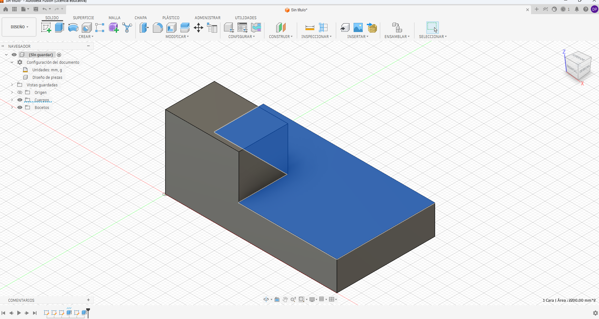
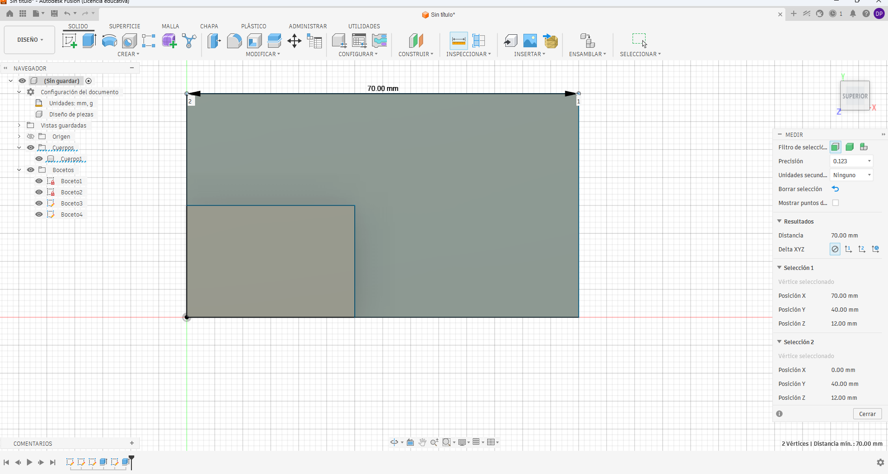

# ICT401 · Semana 9 — Registro de interpretación y reconstrucción 3D

14 al 19 de septiembre de 2026.

- Estudiante: [David Picon Mendez]
- Grupo: [60]
- Carpeta o proyecto de Fusion Cloud con acceso docente: [David Pcon]
- Copias personales: `ICT401_S09_P1_Apellido_Nombre`, `ICT401_S09_P2_Apellido_Nombre`, `ICT401_S09_P3_Apellido_Nombre`.

## Instrucciones

Copie esta plantilla a `Portafolio/semana09/` y guárdela como `S09_Registro_Apellido_Nombre.md`. Sustituya `Apellido_Nombre` por un apellido y un nombre sin espacios ni tildes. Complete cada `[Respuesta]`, agregue las imágenes solicitadas en la misma carpeta y haga commit.

Conserve siempre la estrategia inicial. Si modifica una decisión durante el modelado, no borre lo anterior: describa qué cambió, qué evidencia del plano o del modelo motivó la corrección y qué elemento paramétrico modificó.

X = ancho, Y = profundidad, Z = altura. Trabaje en milímetros. Cuando compare vistas, mantenga Front, Top y Right con orientación coherente y cámara ortográfica.

---

## P1 — Del plano a la estrategia de modelado

### P1.1 · Dimensiones generales identificadas antes de abrir Fusion

- X total: [70 mm]
- Y total: [40 mm]
- Z total: [40 mm]

### P1.2 · Características geométricas identificadas

| Característica | Descripción | Vista(s) que la definen | Dimensiones asociadas |
|---|---|---|---|
| 1 | [Base rectangular  | [Front, Top y Right ] | [ 70 × 40 mm, altura 12 mm] |
| 2 | [Resalte posterior] | [Front, Top y Right] | [30 mm de ancho, 20 mm de profundidad ] |
| 3 | [Posición del resalte | [TOP] | [X = 0–30 mm, Y = 20–40 mm ] |
| 4 | [ Altura final de la pieza ] | [Front y Right| [30 mm] |

### P1.3 · ¿Qué plano de boceto utilizará primero y por qué?

[Utilizaré primero el plano XZ (Front), porque permite definir el perfil principal de la pieza y establecer el ancho y las alturas principales. Después utilizaré la profundidad indicada por las vistas Top y Right para completar el modelo.]

### P1.4 · Estrategia inicial de modelado

1. [Crearé un Sketch en el plano XZ y dibujaré el perfil frontal de la pieza.]
2. [Aplicaré las dimensiones principales de 70 mm de ancho, 12 mm de altura de la base y 30 mm de altura total.]
3. Finalizaré el Sketch y realizaré una extrusión de 40 mm para obtener la profundidad total.]
4. [ Comprobaré que el resalte tenga 30 mm de ancho y 20 mm de profundidad y que esté ubicado en la parte posterior izquierda.
5. [ Compararé las vistas Front, Top y Right del modelo con el plano para comprobar que la geometría sea correcta.

### P1.5 · Después de comprobar en Fusion, ¿qué parte de la estrategia funcionó y qué tuvo que corregir?

[La estrategia funcionó correctamente porque comenzar con el perfil frontal permitió definir las dimensiones principales de la pieza. La extrusión permitió obtener la profundidad total. Al comparar las vistas Front, Top y Right con el plano, no fue necesario realizar correcciones importantes.]

### P1.6 · ¿Qué vista o dimensión permitió detectar la corrección?

[La comparación de las vistas Front, Top y Right permitió comprobar que el modelo coincidía con el plano. Las dimensiones de 70 mm de ancho, 40 mm de profundidad y 30 mm de altura confirmaron que la geometría era correcta.]

### Evidencias P1

Modelo parcial o final en orientación pictórica, con nombre del diseño y ViewCube visibles.

Captura donde se vea el Sketch, dimensión u operación que mejor representa la estrategia seguida.

---

## P2 — Dos estrategias para una misma pieza

### P2.1 · Resuma la estrategia A

La estrategia A consiste en crear primero el perfil principal de la pieza en el plano XZ, utilizando la vista Front. Después se extruye el perfil a toda la profundidad y finalmente se crea la perforación vertical pasante.]

### P2.2 · Resuma la estrategia B

[La estrategia B consiste en construir primero la base desde un Sketch en XY y extruirla. Después se crea la torre mediante un segundo Sketch y una segunda extrusión con Join. Finalmente se realiza la perforación vertical pasante.]

### P2.3 · ¿Ambas estrategias pueden producir la misma geometría? Justifique.

Sí, ambas estrategias pueden producir la misma geometría final. La diferencia está en la forma de construirla: la estrategia A parte de un perfil completo, mientras que la estrategia B construye la pieza mediante características sucesivas como la base y la torre.

### P2.4 · Compare las estrategias

| Criterio | Estrategia A | Estrategia B | ¿Cuál considera mejor y por qué? |
|---|---|---|---|
| Número de operaciones | [Menor cantidad de operaciones] | [ Mayor cantidad de operaciones] | [Respuesta] |
| Claridad de intención de diseño | [El perfil completo se encuentra en una sola operación] | [Las características están separadas y son fáciles de identificar ] | [Estrategia B, porque permite distinguir claramente la base y la torre.] |
| Facilidad de edición | [ Los cambios pueden requerir modificar el perfil principal] | [ La base y la torre pueden modificarse por separado ] | [Respuesta] |
| Dependencia entre operaciones | [Existe mayor dependencia del perfil principal] | [Las características están más separadas] | [ Estrategia B, porque facilita modificar características individuales. ] |
| Correspondencia con el plano | [ Representa directamente el perfil de la vista Front] | [ Representa la pieza mediante sus características principales] | [Ambas corresponden al plano, pero B facilita identificar cada característica |

### P2.5 · Si cambia una dimensión principal de la pieza, ¿qué estrategia sería más fácil de modificar? Explique qué Sketch u operación tendría que editar.

[La estrategia B sería más fácil de modificar porque la base y la torre se encuentran en características separadas. Por ejemplo, si cambia el ancho de la torre, se puede editar el Sketch utilizado para crear la torre y actualizar la extrusión correspondiente, sin tener que modificar todo el perfil principal.
### P2.6 · ¿Cuál estrategia usaría finalmente y por qué?

[Finalmente utilizaría la estrategia B porque permite organizar la pieza mediante características independientes y facilita realizar cambios en el modelo. Además, el timeline permite identificar con mayor claridad la base, la torre y la perforación.]

### Evidencias P2

Captura del historial/timeline y del modelo obtenido con la estrategia seleccionada.

---

## P3 — Plano → modelo → plano

### P3.1 · Antes de modelar, describa la pieza en una frase técnica

[Respuesta]

### P3.2 · Dimensiones y características clave

| Elemento | Valor o descripción | Vista(s) de donde se obtiene |
|---|---|---|
| X total | [Respuesta] | [Respuesta] |
| Y total | [Respuesta] | [Respuesta] |
| Z total | [Respuesta] | [Respuesta] |
| Característica 1 | [Respuesta] | [Respuesta] |
| Característica 2 | [Respuesta] | [Respuesta] |
| Característica 3 | [Respuesta] | [Respuesta] |

### P3.3 · Estrategia inicial

1. [Respuesta]
2. [Respuesta]
3. [Respuesta]
4. [Respuesta]
5. [Respuesta]

### P3.4 · Verificación de vistas

| Vista | ¿Coincide con el plano? | Contorno/característica comprobada | Corrección realizada |
|---|---|---|---|
| Front | [Respuesta] | [Respuesta] | [Respuesta] |
| Top | [Respuesta] | [Respuesta] | [Respuesta] |
| Right | [Respuesta] | [Respuesta] | [Respuesta] |

### P3.5 · Verificación dimensional

| Dimensión crítica | Valor del plano | Valor medido en Fusion | Elemento medido | ¿Coincide? |
|---|---|---|---|---|
| 1 | [Respuesta] | [Respuesta] | [Respuesta] | [Respuesta] |
| 2 | [Respuesta] | [Respuesta] | [Respuesta] | [Respuesta] |
| 3 | [Respuesta] | [Respuesta] | [Respuesta] | [Respuesta] |
| 4 | [Respuesta] | [Respuesta] | [Respuesta] | [Respuesta] |

### P3.6 · ¿Qué cambió entre su estrategia inicial y el modelo final?

[Respuesta]

### P3.7 · Si tuviera que cambiar una dimensión principal, ¿qué Sketch, dimensión u operación editaría?

[Respuesta]

### Evidencias P3

Modelo final en orientación pictórica, con nombre y ViewCube visibles.

Montaje de Front, Top y Right del modelo para compararlos con el plano.

Captura de una comprobación dimensional con `Inspect > Measure`.

---

## Reflexión final

La diferencia principal entre reconstruir una pieza en Semana 8 y reconstruirla desde un plano en Semana 9 es:

[Respuesta]

Antes de abrir Fusion, la información mínima que debo extraer de un plano es:

[Respuesta]

Una estrategia de modelado es mejor que otra cuando:

[Respuesta]

La comprobación final más importante para asegurar que el modelo corresponde al plano es:

[Respuesta]

## Checklist

- [ ] Registré la estrategia inicial de P1 antes de comprobar en Fusion.
- [ ] Comparé dos estrategias en P2 y justifiqué mi selección.
- [ ] Reconstruí P3 a partir del plano sin usar un modelo 3D de referencia.
- [ ] Comparé Front, Top y Right contra el plano.
- [ ] Verifiqué al menos cuatro dimensiones críticas en P3.
- [ ] Documenté las correcciones sin borrar mis decisiones iniciales.
- [ ] Las cinco imágenes se visualizan correctamente en GitHub.
- [ ] Los modelos P1–P3 están disponibles en Fusion Cloud con acceso docente.
- [ ] Completé la reflexión final.

Commit sugerido: `S09 ejercicios Fusion Apellido Nombre`.

Corrección posterior: `S09 correccion Fusion Apellido Nombre`.
