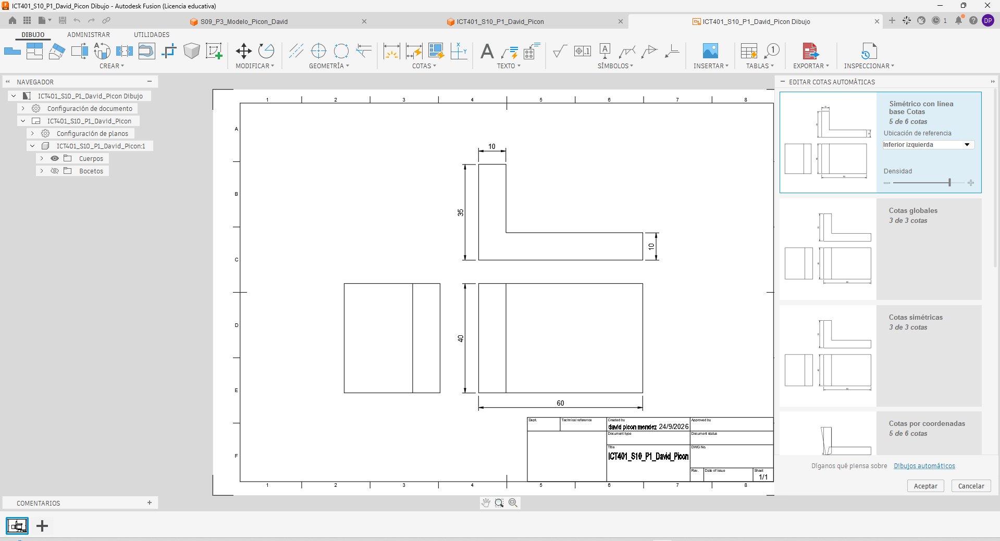
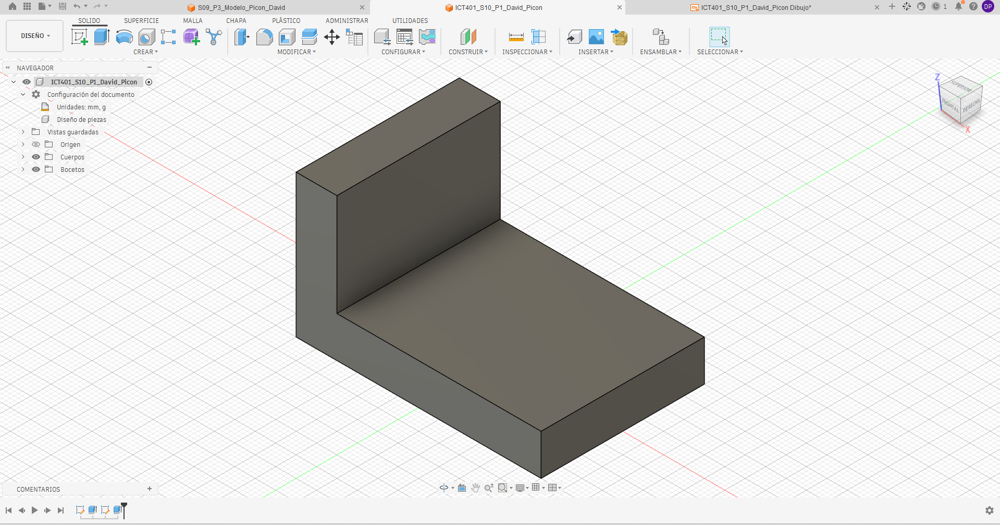

# ICT401 · Semana 10 — Registro de vistas técnicas y acotación normalizada

21 al 26 de septiembre de 2026.

- Estudiante: [David Picon Mendez]
- Grupo: [60]
- Carpeta o proyecto de Fusion Cloud con acceso docente: [Respuesta]
- Modelos utilizados: `ICT401_S09_P1_Apellido_Nombre`, `ICT401_S09_P2_Apellido_Nombre`, `ICT401_S09_P3_Apellido_Nombre` u otros equivalentes.

## Instrucciones

Copie esta plantilla a `Portafolio/semana10/` y guárdela como `S10_Registro_Apellido_Nombre.md`. Sustituya `Apellido_Nombre` por un apellido y un nombre sin espacios ni tildes. Complete cada `[Respuesta]`, agregue las imágenes solicitadas en la misma carpeta y haga commit.

Documente cada decisión de selección de vistas y acotación. Si modifique una decisión durante el proceso, no borre lo anterior: describa qué cambio, qué evidencia del modelo o del Drawing motivó la corrección y qué ajuste realizó.

X = ancho, Y = profundidad, Z = altura. Trabaje en milímetros. Cuando compare vistas, mantenga Front, Top y Right con orientación coherente y cámara ortográfica.

---

## P1 — Del modelo 3D a las vistas técnicas

### P1.1 · Modelo utilizado

- Nombre del diseño en Fusion: S09_P3_Modelo_Picon_David]
- Pieza de referencia (semana de origen): [S09_P3_Modelo_Picon_David]

### P1.2 · Características principales del modelo

| Característica | Descripción | Vista(s) que la comunican |
|---|---|---|
| 1 | [Base rectangular] | [Front, Top y Right] |
| 2 | [Pared vertical] | [Front, Top y Righta] |
| 3 | [Forma general en L] | [front] |
| 4 | [Profundidad y separación entre la base y la pared] | [top] |

### P1.3 · Vistas seleccionadas y justificación

| Vista | ¿Es necesaria? | ¿Por qué? | ¿Qué información aporta? |
|---|---|---|---|
| Front | si] | [Permite identificar claramente la forma principal de la pieza.] | [Muestra la forma en L.] |
| Top | [Si] | [Permite complementar la información que no se observa completamente desde Front.] | [Muestra la profundidad y la separación entre la base y la pared] |
| Right | [Si] | [Permite comprobar la geometría lateral de la pieza.] | [Confirma la altura y la posición de la pared.] |
| Otra: [No] | [No es necesaria otra vista para comunicar la pieza.] | [Front, Top y Right proporcionan la información necesaria.] | 
### P1.4 · ¿Algual vista resultó redundante? ¿Cuál y por qué?

[No. Ninguna de las vistas seleccionadas resultó redundante, ya que Front, Top y Right aportan información diferente y complementaria sobre la geometría de la pieza. En conjunto permiten identificar la forma, profundidad, altura y posición de la pared.]

### P1.5 · Método utilizado para generar las vistas en Fusion

Primero abrí el modelo construido en la Semana 9. Después generé las vistas ortogonales utilizando el entorno Drawing o la función de vistas del modelo en Fusion. Seleccioné las vistas Front, Top y Right y posteriormente comprobé que mantuvieran la correspondencia geométrica con el modelo 3D. Finalmente revisé la información que aporta cada vista y verifiqué que no fuera necesario agregar otra vista.]

### Evidencias P1

Captura de las vistas ortogonales generadas desde el modelo.

Modelo 3D en orientación isométrica con nombre y ViewCube visibles.

---

## P2 — Creación del plano desde el modelo

### P2.1 · Configuración del Drawing

- Formato seleccionado: [A4]
- Orientación: [HorizontaL]
- Escala: [1:1]
- Justificación de cada elección: [Se seleccionó el formato A4 porque permite organizar las tres vistas de la pieza de manera clara. Se utilizó orientación horizontal para disponer correctamente las vistas Front, Top y Right y dejar espacio suficiente para las cotas. Se seleccionó una escala 1:1 para mantener el tamaño real de la pieza y facilitar la lectura de las vistas.]

### P2.2 · Disposición de vistas

| Vista | Posición en el Drawing | Distancia a la vista adyacente | ¿Alineada correctamente? |
|---|---|---|---|
| Front (base) | [Vista principal, ubicada como referencia para las demás vistas] | [Suficiente para colocar las cotas] | [sI] |
| Top | [Ubicada encima de Front y proyectada desde ella] | [Suficiente para mantener separación y legibilidad] | [sI] |
| Right | [Ubicada al lado derecho de Front y proyectada desde ella] | [Suficiente para colocar las cotas] | [sI] |

### P2.3 · ¿Qué problemas de alineación o disposición detectó? ¿Cómo los resolvió?

[Se revisó que las vistas Front, Top y Right estuvieran correctamente alineadas y que no existieran superposiciones. También se verificó que hubiera suficiente separación entre las vistas para poder colocar las cotas posteriormente. Cuando fue necesario, se ajustó la posición de las vistas manteniendo la proyección y correspondencia geométrica con la vista base.]

### P2.4 · ¿La escala permite legibilidad de todas las vistas? Justifique.

[Sí. La escala seleccionada permite visualizar las tres vistas de forma clara y mantenerlas dentro del formato del Drawing. Las líneas y características principales de la pieza se pueden distinguir correctamente y queda espacio suficiente para incorporar las cotas sin afectar la legibilidad del plano.]

### Evidencias P2

Captura del Drawing con las tres vistas insertadas y alineadas.

---

## P3 — Acotación normalizada básica

### P3.1 · Dimensiones generales aplicadas

| Dimensión | Valor | Vista donde se colocó | Justificación |
|---|---|---|---|
| Ancho total (X) | [Respuesta] | [Respuesta] | [Respuesta] |
| Profundidad total (Y) | [Respuesta] | [Respuesta] | [Respuesta] |
| Altura total (Z) | [Respuesta] | [Respuesta] | [Respuesta] |

### P3.2 · Dimensiones parciales y funcionales

| Característica | Dimensión | Valor | Vista | ¿Repetida en otra vista? |
|---|---|---|---|---|
| [Respuesta] | [Respuesta] | [Respuesta] | [Respuesta] | [Respuesta] |
| [Respuesta] | [Respuesta] | [Respuesta] | [Respuesta] | [Respuesta] |
| [Respuesta] | [Respuesta] | [Respuesta] | [Respuesta] | [Respuesta] |
| [Respuesta] | [Respuesta] | [Respuesta] | [Respuesta] | [Respuesta] |

### P3.3 · ¿Eliminó alguna cota por redundante? ¿Cuál?

[Respuesta]

### P3.4 · ¿Alguna dimensión quedó dentro del contorno de la vista? ¿Qué hizo al respecto?

[Respuesta]

### P3.5 · ¿Qué criterio de organización utilizó para disponer las cotas?

[Respuesta]

### Evidencias P3

Captura del Drawing con las cotas aplicadas.

Detalle de una zona del plano donde se aprecie la organización de las cotas.

---

## P4 — Práctica guiada de plano técnico

### P4.1 · Pieza documentada

- Nombre del diseño: [Respuesta]
- Pieza de referencia: [Respuesta]

### P4.2 · Vistas generadas

| Vista | Información que comunica | Cotas asignadas |
|---|---|---|
| Front | [Respuesta] | [Respuesta] |
| Top | [Respuesta] | [Respuesta] |
| Right | [Respuesta] | [Respuesta] |

### P4.3 · Resumen de cotas aplicadas

| Tipo de dimensión | Cantidad | Ejemplo |
|---|---|---|
| Generales | [Respuesta] | [Respuesta] |
| Parciales | [Respuesta] | [Respuesta] |
| Funcionales | [Respuesta] | [Respuesta] |

### P4.4 · ¿El plano contiene información suficiente para fabricar la pieza? ¿Falta algo?

[Respuesta]

### P4.5 · Errores encontrados y correcciones realizadas

| Error detectado | Corrección aplicada | Vista afectada |
|---|---|---|
| [Respuesta] | [Respuesta] | [Respuesta] |
| [Respuesta] | [Respuesta] | [Respuesta] |

### Evidencias P4

Drawing completo con vistas y cotas.

Comparación del Drawing con el modelo 3D.

---

## Reflexión final

La diferencia principal entre documentar una pieza en Semana 9 (reconstrucción desde plano) y documentarla en Semana 10 (generación de vistas desde modelo) es:

[Respuesta]

Los criterios que utilicé para seleccionar las vistas necesarias fueron:

[Respuesta]

Los principios de acotación normalizada que más influyeron en la claridad de mi plano fueron:

[Respuesta]

Si tuviera que agregar una vista adicional a una de mis piezas, sería:

[Respuesta]

## Checklist

- [ ] Seleccioné las vistas necesarias y justifiqué cada una.
- [ ] Generé las vistas ortogonales correctamente alineadas.
- [ ] Configuré formato, orientación y escala de manera coherente.
- [ ] Apliqué dimensiones generales, parciales y funcionales.
- [ ] Evité cotas repetidas, ambiguas o innecesarias.
- [ ] Organice las cotas fuera del contorno de las vistas.
- [ ] El plano contiene información suficiente para fabricar la pieza.
- [ ] Documenté errores y correcciones sin borrar decisiones iniciales.
- [ ] Las evidencias se visualizan correctamente en GitHub.
- [ ] Los Drawing están disponibles en Fusion Cloud con acceso docente.
- [ ] Completé la reflexión final.

## Cierre del Portafolio Técnico 2

La revisión del portafolio abarca las **semanas 6 a 10**. El plazo para completar y publicar los pendientes de **Semana 10** es el **viernes 25 de septiembre de 2026, a las 11:59 p. m., hora de Costa Rica**. Este plazo no habilita correcciones de las semanas 6 a 9.

Antes del cierre verifique:

- [ ] Las fichas de las semanas 6--10 están completas en `Portafolio/semanaXX/`.
- [ ] Las imágenes y enlaces se visualizan correctamente desde GitHub.
- [ ] Las correcciones están documentadas sin borrar respuestas iniciales.
- [ ] Los modelos están disponibles en Fusion Cloud con acceso docente.
- [ ] Los últimos cambios están publicados en GitHub.

Commit sugerido: `S10 ejercicios Fusion Apellido Nombre`.

Corrección posterior: `S10 correccion Fusion Apellido Nombre`.
